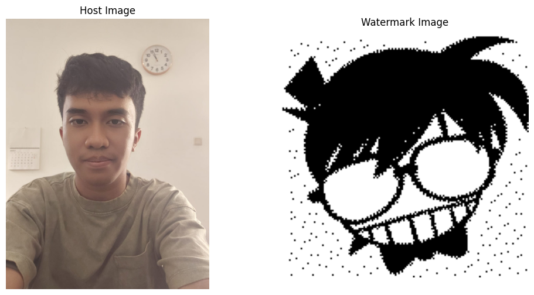
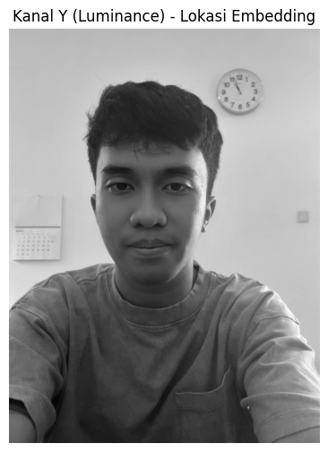
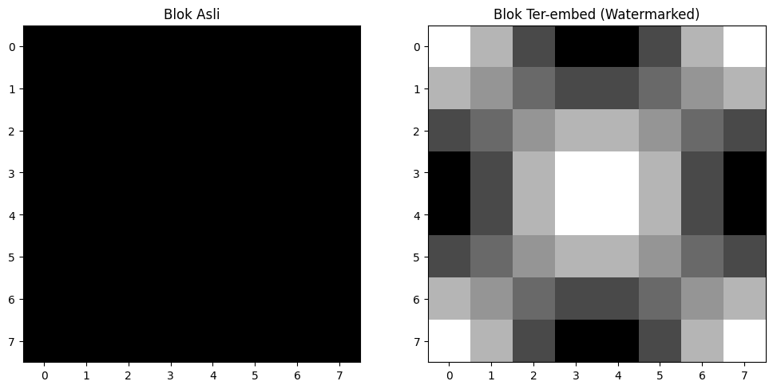

# JPEG Watermarking (QIM)

Proyek ini adalah implementasi sistem *digital watermarking* pada citra JPEG menggunakan metode Quantization Index Modulation (QIM) di domain frekuensi menengah (Mid-Frequency DCT). Dokumentasi ini diadaptasi dari laporan "18224070_Dokumentasi JPEG Watermarking".

---

## 1. Teori Singkat

### 1.1 Kompresi JPEG
Sistem kompresi JPEG bekerja melalui beberapa tahapan berurutan:
1. **Konversi Warna**: Mengubah gambar RGB ke format YCbCr (Y untuk kecerahan, Cb/Cr untuk warna).
2. **Subsampling**: Mengurangi resolusi komponen warna untuk menghemat ruang.
3. **Pembagian Blok**: Membagi gambar menjadi matriks blok kecil berukuran 8x8 piksel.
4. **Discrete Cosine Transform (DCT)**: Mengubah setiap blok dari domain spasial menjadi domain frekuensi (frekuensi rendah untuk detail utama, frekuensi tinggi untuk detail halus).
5. **Quantization**: Membagi nilai frekuensi dengan tabel kuantisasi (tahapan utama terjadinya *lossy compression*).
6. **Encoding**: Mengkodekan data menggunakan teknik seperti Run-Length Encoding (RLE) dan Huffman Coding.

### 1.2 Digital Watermarking
Teknik penyisipan informasi tersembunyi ke dalam media digital untuk tujuan pembuktian kepemilikan atau autentikasi data, yang dirancang agar tidak merusak kualitas visual gambar secara kasat mata.

### 1.3 Metode Quantization Index Modulation (QIM)
Untuk mencapai *robustness* yang tinggi, proyek ini menyisipkan watermark dengan cara memodulasi koefisien frekuensi:
*   **Bit 0**: Koefisien DCT dibulatkan ke kelipatan genap dari sebuah nilai langkah (step size / parameter delta).
*   **Bit 1**: Koefisien DCT dibulatkan ke kelipatan ganjil dari nilai langkah tersebut.

---

## 2. Implementasi

Proyek ini diimplementasikan menggunakan Python dengan berbagai fitur otomasi. Untuk menginstal *dependencies*, jalankan:
```bash
pip install -r requirements.txt
```

### 2.1 Proses Embedding
Proses penyisipan dilakukan pada frekuensi menengah blok 8x8. Anda dapat menggunakan skrip `QIM_embed.py` (CLI) atau `watermark.py` (Interactive).

**Contoh Penggunaan:**
```bash
# Mengecek kapasitas maksimal bit yang bisa disisipkan
python QIM_embed.py capacity input_self.jpg

# Menyisipkan watermark
python QIM_embed.py embed input_self.jpg wm_rev.jpg 90 -o watermarked.jpg
```

### 2.2 Proses Extraction
Proses ini adalah kebalikan dari *embedding*, yaitu menganalisis koefisien DCT untuk mengecek apakah ia jatuh lebih dekat ke kelipatan genap atau ganjil.

**Contoh Penggunaan:**
```bash
# Mengekstrak watermark (tambahkan --ref untuk menghitung BER)
python QIM_embed.py extract watermarked.jpg --wm-size 150x150 -o extracted_wm.jpg --ref wm_rev.jpg
```

---

## 3. Hasil Pengetesan

Anda dapat menjalankan pengetesan otomasi untuk semua tingkat kualitas menggunakan perintah:
```bash
python batch_embed.py
```

### 3.1 Hasil Kuantitatif (BER & PSNR)
| QF | MSE | PSNR (dB) | Bit Errors | BER (%) |
| :--- | :--- | :--- | :--- | :--- |
| **90** | 0.6976 | 49.69 | 926 | 4.12 |
| **70** | 2.1457 | 44.82 | 918 | 4.08 |
| **50** | 5.4385 | 40.78 | 918 | 4.08 |
| **30** | 10.1850 | 38.05 | 918 | 4.08 |
| **10** | 67.5706 | 29.83 | 918 | 4.08 |

### 3.3 Visualisasi Langkah-langkah (Notebook)

Anda dapat memvisualisasikan langkah-langkah penyisipan watermark secara mendalam menggunakan notebook `QIM_Visualization.ipynb`. Berikut adalah visualisasi setiap tahapannya:

#### Step 1: Membaca Citra Host dan Watermark
Proses awal dimulai dengan memuat gambar asli (host) dan gambar watermark yang akan disisipkan.


#### Step 2: Konversi Warna ke YCbCr
Gambar dikonversi ke ruang warna YCbCr untuk memisahkan komponen luminansi (Y) dari komponen warna (Cb, Cr). Penyisipan watermark dilakukan pada kanal Y karena mata manusia lebih peka terhadap perubahan intensitas cahaya (luminansi).


#### Step 3: DCT, QIM, dan Rekonstruksi
Pada tahap ini, dilakukan transformasi DCT pada blok 8x8, penyisipan bit watermark melalui modulasi QIM pada koefisien tertentu, dan rekonstruksi kembali menjadi citra. Hasilnya, perbedaan antara blok asli dan blok yang sudah disisipi watermark tidak terlihat oleh mata manusia.


---

## 4. Kesimpulan

Berdasarkan hasil analisis pengetesan, JPEG watermarking menggunakan algoritma QIM pada area *mid-frequency* terbukti sangat efektif karena mampu mempertahankan eksistensi watermark sampai *Quality Factor* 10. Akan tetapi, metode tersebut masih memiliki sisi in-konsisten di mana kompresi kualitas tinggi (Quality Factor 90) justru menghasilkan *bit error* yang paling banyak akibat himpitan batas kuantisasi.

---

## 5. Lampiran

**Struktur Repositori:**
*   `QIM_embed.py`: Skrip utama untuk komando embedding dan ekstraksi.
*   `batch_embed.py`: Skrip untuk menguji ketahanan (robustness) algoritma secara otomatis.
*   `watermark.py`: Skrip alternatif dengan mode menu interaktif (Terminal UI).
*   `utils.py`: Berisi berbagai fungsi kalkulasi matematis pendukung (MSE, PSNR, BER, Capacity).
*   `jpeg_encoder.py`: Eksperimen *custom JPEG encoder* secara murni.